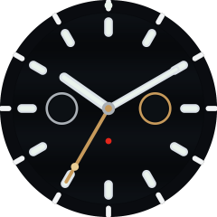

# 007 First Light — Garmin Fenix 8 Pro Watch Face

A high-fidelity Garmin Connect IQ watch face for the **Fenix 8 Pro 47mm** (454×454
AMOLED), inspired by the **Omega Seamaster Diver 300M Chronograph "007 First Light"**.

> Black ceramic wave dial · rhodium broad-arrow lume hands · PVD bronze-gold
> central seconds & 3 o'clock counter · poppy-red *Seamaster* script · white
> Super-LumiNova that glows alive on the wrist.



*Preview rendered by `tools/gen_icons.py` (the same palette the watch face uses).
For the source-watch design brief see
[`docs/DESIGN_REFERENCE.md`](docs/DESIGN_REFERENCE.md).*

---

## What makes it high fidelity

| Element | Treatment |
| --- | --- |
| **Dial** | Laser-engraved horizontal wave guilloché, rendered as layered shaded sine bands on a near-black ceramic base. |
| **Bezel** | Polished black ceramic ring with a white-enamel diving scale (0–60), luminous 12 o'clock pip. |
| **Hands** | Skeletonised rhodium broad-arrow hour/minute hands with white lume inlays; thin bronze-gold central seconds with lollipop + counterweight. |
| **Subdials** | Bicompax layout true to caliber 9900 — small running indicator at 9, bronze-ringed counter at 3, date window at 6. |
| **Accents** | PVD bronze-gold and poppy-red, exactly where Omega placed them. |
| **Lume** | Markers and hands carry a luminous fill with a soft AMOLED bloom; a "First Light" dawn sweep animates across the dial on wrist-raise. |
| **Performance** | Static art is pre-rendered once into an off-screen buffer and blitted each frame; only the hands and live complications redraw. |

## Spec-driven development

This project is built with a lightweight **spec-driven development (SDD)** flow.
Code is downstream of an approved spec. The contract lives in
[`specs/001-bond-seamaster-007-first-light/`](specs/001-bond-seamaster-007-first-light/):

1. **[`requirements.md`](specs/001-bond-seamaster-007-first-light/requirements.md)** — what & why, as EARS-style acceptance criteria.
2. **[`design.md`](specs/001-bond-seamaster-007-first-light/design.md)** — architecture, render pipeline, geometry & color tokens.
3. **[`tasks.md`](specs/001-bond-seamaster-007-first-light/tasks.md)** — the ordered, checkable implementation plan.

The principles that govern the loop are in
[`docs/CONSTITUTION.md`](docs/CONSTITUTION.md).

## Build & run

Requires the [Connect IQ SDK](https://developer.garmin.com/connect-iq/sdk/) (≥ 7.x,
API level 5.1) and a developer key.

```bash
# generate launcher icons (pure-python, no deps)
python3 tools/gen_icons.py

# compile for the Fenix 8 Pro 47mm simulator
monkeyc -d fenix8pro47mm -f monkey.jungle -o bin/007FirstLight.prg -y developer_key

# run in the Connect IQ simulator
connectiq && monkeydo bin/007FirstLight.prg fenix8pro47mm
```

Build a sideloadable/store package:

```bash
monkeyc -e -f monkey.jungle -o bin/007FirstLight.iq -y developer_key
```

> The Fenix 8 Pro restricts *app* installs to Garmin-certified titles for LTE
> security, but **watch faces are unaffected** — they sideload and distribute
> through the Connect IQ Store as normal.

## Settings

Configurable from Garmin Connect / Connect IQ Store app:

- **Dial theme** — Black Ceramic (default) · Dawn First-Light
- **Accent** — Bronze (default) · Red
- **Left dial (9 o'clock)** data — 24-hour · Heart rate · Body Battery · Off
- **Right dial (3 o'clock)** data — Battery · Steps · Active minutes · Off
- **Seconds hand** — Sweep · Hidden in always-on (default) · Always hidden
- **Wrist-raise dawn sweep** — On (default) · Off

## License

Personal/fan project. "Omega", "Seamaster", "007" and related marks belong to
their respective owners; this is an unaffiliated tribute rendering.
