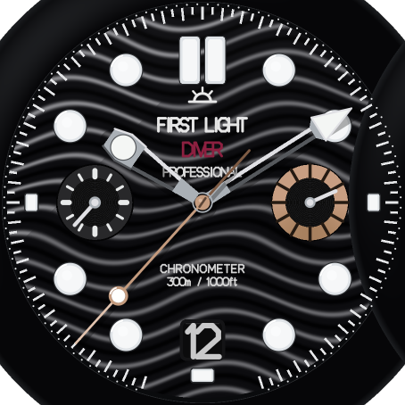
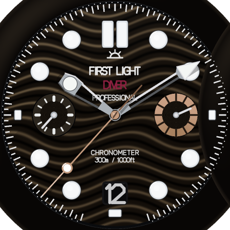
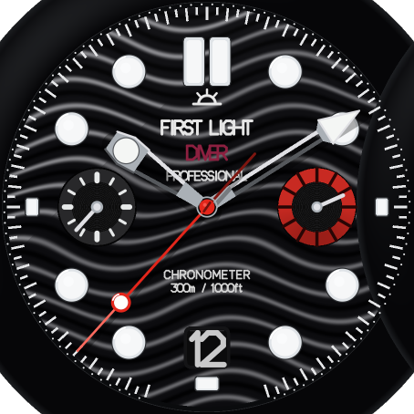

# 007 First Light — Fenix 8 Pro Watch Face

A high-fidelity Connect IQ watch face for the **Fenix 8 Pro 47mm** (454×454
AMOLED) in the style of a classic **professional dive chronograph**.

> Black ceramic wave dial · broad-arrow lume hands · bronze-gold central seconds
> & 3 o'clock counter · red *Diver* accent · luminous markers that glow alive on
> the wrist.

> **Trademark-free:** the dial and store art carry no third-party brand names or
> logos (Garmin Connect IQ review requirement). The earlier brand-styled build is
> preserved on the `archive/omega-seamaster-edition` branch for reference only.

| Black Ceramic | Dawn First-Light | Poppy Red accent |
| :---: | :---: | :---: |
|  |  |  |

*454×454 mockups rendered by `tools/gen_preview.py` (the same palette and
geometry the watch face uses). For the source-watch design brief see
[`docs/DESIGN_REFERENCE.md`](docs/DESIGN_REFERENCE.md); to publish, see
[`PUBLISHING.md`](PUBLISHING.md).*

---

## What makes it high fidelity

| Element | Treatment |
| --- | --- |
| **Dial** | Laser-engraved horizontal wave guilloché, rendered as layered shaded sine bands on a near-black ceramic base. |
| **Bezel** | Polished black ceramic ring with a white-enamel diving scale (0–60), luminous 12 o'clock pip. |
| **Hands** | Skeletonised rhodium broad-arrow hour/minute hands with white lume inlays; thin bronze-gold central seconds with lollipop + counterweight. |
| **Subdials** | Bicompax layout true to caliber 9900 — small running indicator at 9, bronze-ringed counter at 3, date window at 6. |
| **Accents** | PVD bronze-gold and poppy-red, placed like a classic dive chronograph. |
| **Lume** | Markers and hands carry a luminous fill with a soft AMOLED bloom; a "First Light" dawn sweep animates across the dial on wrist-raise. |
| **Performance** | Static art is pre-rendered once into an off-screen buffer and blitted each frame; only the hands and live complications redraw. |

## Spec-driven development

This project is built with a lightweight **spec-driven development (SDD)** flow.
Code is downstream of an approved spec. The contract lives in
[`specs/001-bond-seamaster-007-first-light/`](specs/001-bond-seamaster-007-first-light/):

1. **[`requirements.md`](specs/001-bond-seamaster-007-first-light/requirements.md)** — what & why, as EARS-style acceptance criteria.
2. **[`design.md`](specs/001-bond-seamaster-007-first-light/design.md)** — architecture, render pipeline, geometry & color tokens.
3. **[`tasks.md`](specs/001-bond-seamaster-007-first-light/tasks.md)** — the ordered, checkable implementation plan.

The principles that govern the loop are in
[`docs/CONSTITUTION.md`](docs/CONSTITUTION.md).

## Build & run

Requires the [Connect IQ SDK](https://developer.garmin.com/connect-iq/sdk/) (≥ 7.x,
API level 5.1) and a developer key.

```bash
# generate launcher icons + marketing mockups (pure-python, no deps)
python3 tools/gen_icons.py
python3 tools/gen_preview.py

# compile for the Fenix 8 Pro 47mm simulator
monkeyc -d fenix8pro47mm -f monkey.jungle -o bin/007FirstLight.prg -y developer_key.der

# run in the Connect IQ simulator
connectiq && monkeydo bin/007FirstLight.prg fenix8pro47mm
```

Build a sideloadable/store package:

```bash
monkeyc -e -f monkey.jungle -o dist/007FirstLight.iq -y developer_key.der
```

To publish to the Connect IQ Store, follow [`PUBLISHING.md`](PUBLISHING.md). CI
builds the signed `.iq` on every push, and tagging `vX.Y.Z` attaches it to a
GitHub Release.

> The Fenix 8 Pro restricts *app* installs to Garmin-certified titles for LTE
> security, but **watch faces are unaffected** — they sideload and distribute
> through the Connect IQ Store as normal.

## Continuous integration

[`.github/workflows/ci.yml`](.github/workflows/ci.yml) runs on every push/PR:

- **assets-and-lint** — regenerates the icons and validates every XML resource
  (no SDK required).
- **build** — compiles the face for `fenix8pro47mm` inside the
  `ghcr.io/matco/connectiq-tester` image (bundles `monkeyc`, the SDK and device
  files), generating a throwaway developer key, and uploads the `.prg` artifact.

This is the automated counterpart to verification tasks **T7.1** in the spec.
Override the compile target by setting the `CIQ_DEVICE` env in the workflow.

## Settings

Configurable from Garmin Connect / Connect IQ Store app:

- **Dial theme** — Black Ceramic (default) · Dawn First-Light
- **Accent** — Bronze (default) · Red
- **Left dial (9 o'clock)** data — 24-hour · Heart rate · Body Battery · Off
- **Right dial (3 o'clock)** data — Battery · Steps · Active minutes · Off
- **Seconds hand** — Sweep · Hidden in always-on (default) · Always hidden
- **Wrist-raise dawn sweep** — On (default) · Off

## License

Personal project. The dial and store art are trademark-free. Any resemblance
to existing timepieces is stylistic; all third-party marks belong to their
respective owners and are not used in the app or its store listing.
